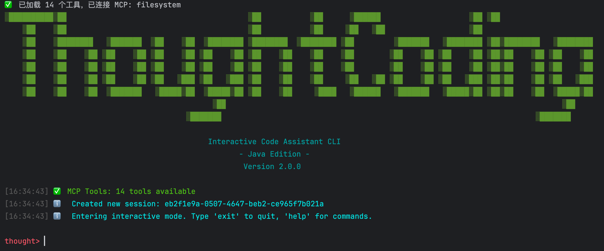

# ThoughtCoding CLI



一个基于 LangChain4j 的交互式代码助手 CLI 工具，支持原生 Function Calling、流式输出和智能对话。

## 🎥 项目演示

[](https://www.bilibili.com/video/BV14D4uzWEhC?vd_source=5a2abdf9d1d2a4d1cb15fa9b92f6fbb2)

*点击按钮前往bilibili观看完整项目演示*

## 🚀 项目特性

- **智能对话** - 基于多种 AI 模型的智能代码助手
- **流式输出** - 支持实时流式响应，提供更好的交互体验
- **原生 Function Calling** - 基于 LangChain4j 原生 function calling 的多轮 agentic 循环（工具结果按 `providerCallId` 自动配对回喂）
- **MCP 集成** - 内置 Model Context Protocol 支持，可连接丰富的工具生态系统
- **工具扩展** - 通过 MCP 支持文件管理、数据库操作、搜索、GitHub 等 50+ 种工具
- **动态工具发现** - 自动发现和注册 MCP 服务器的可用工具
- **即插即用** - 无需重启即可动态连接新的 MCP 服务器
- **预定义工具** - 内置常用 MCP 工具快捷方式，一键连接
- **技能系统** - 内置 6 个技能（docx/pdf/pptx/xlsx/mcp-builder/skill-creator），模型可按需加载 `SKILL.md` 完整说明
- **子代理** - `subAgent` 工具派发隔离的子 Agent 执行独立子任务，仅回传最终结论
- **统一权限管道** - `PermissionGate` 收敛写/执行类工具的执行决策，越界只读操作弹确认，危险命令硬拒绝
- **配置管理** - 灵活的 YAML 配置文件系统，支持 MCP 服务器动态配置
- **类型安全** - 完整的 Java 类型定义和封装
- **终端 UI** - 基于 JLine + ANSI 颜色的现代化终端界面
- **会话管理** - 会话保存、加载和会话继续功能
- **上下文管理** - 四层压缩管线（落盘 / 裁中段 / 旧结果占位 / LLM 摘要），防止 Token 超限
- **项目感知** - 自动检测项目类型（Maven/Gradle/NPM），提供项目上下文
- **工具确认** - 写/执行类工具执行前用户确认，只读工具在 workspace 内静默放行、越界弹确认
- **性能监控** - 内置性能监控和 Token 使用统计
- **智能搜索** - 文件名搜索（glob）+ 文件内容搜索（bash 内的 grep/rg）
- **跨平台支持** - 支持 Windows、Linux、macOS 系统

## 🏗项目结构

```
ThoughtCoding/
├── 📁 src/main/java/com/thoughtcoding/
│   ├── 📁 cli/                          # 🎯 命令行接口
│   │   ├── ThoughtCodingCommand.java    # 主命令处理器
│   │   ├── SessionCommand.java          # 会话管理命令
│   │   ├── ConfigCommand.java           # 配置管理命令
│   │   └── MCPCommand.java              # MCP 管理命令
│   ├── 📁 core/                         # 🔧 核心功能
│   │   ├── ThoughtCodingContext.java    # 应用上下文（依赖注入容器）
│   │   ├── AgentLoop.java               # Agent 循环引擎（原生 function calling）
│   │   ├── SubAgent.java                # 子代理（隔离子任务）
│   │   ├── ProjectContext.java          # 项目上下文检测
│   │   ├── ToolExecutionConfirmation.java # 工具执行确认（YES/NO 两选项）
│   │   └── DirectCommandExecutor.java   # 直接命令执行器（/ 斜杠命令）
│   ├── 📁 service/                      # 🛠️ 服务层
│   │   ├── LangChainService.java        # AI 服务核心
│   │   ├── SessionService.java          # 会话数据管理
│   │   ├── AIService.java               # AI 服务接口
│   │   ├── ContextManager.java          # 上下文管理器（历史窗口、Token控制）
│   │   └── PerformanceMonitor.java      # 性能监控
│   ├── 📁 tool/                         # 🔨 工具层
│   │   ├── BaseTool.java                # 工具抽象基类（name/description/execute）
│   │   ├── ToolRegistry.java            # 工具注册中心
│   │   ├── ToolDispatcher.java          # 工具执行收口（查表 + 参数序列化）
│   │   ├── ToolSpecificationFactory.java # BaseTool → ToolSpecification 转换（三级降级）
│   │   └── 📁 tools/                     # 内置工具实现
│   │       ├── BashTool.java            # 命令执行（Windows→PowerShell, Linux/Mac→bash）
│   │       ├── ReadTool.java            # 文件读取（cat -n 风格行号输出）
│   │       ├── WriteTool.java           # 文件创建/覆写
│   │       ├── EditTool.java            # 精确字符串替换（\r\n 自动规范化）
│   │       ├── GlobTool.java            # 文件名搜索（walkFileTree，跳过 node_modules）
│   │       ├── TodoWriteTool.java       # 内存待办清单（跨调用状态）
│   │       ├── SkillTool.java           # 加载 skills/*/SKILL.md
│   │       └── SubAgentTool.java        # 派发隔离子 Agent
│   ├── 📁 security/                     # 🔐 权限与沙箱
│   │   ├── PermissionGate.java          # 统一权限管道（按工具名决策 ALLOW/WARN/DENY）
│   │   ├── PermissionHook.java          # 把权限检查挂进 Hook 链（PRE_TOOL_USE）
│   │   ├── PermissionResult.java        # 权限决策结果
│   │   └── Sandbox.java                # 工作区路径解析（仅规范化，不拦截越界）
│   ├── 📁 hook/                         # 🪝 Hook 系统（可扩展拦截点）
│   │   ├── Hook.java / HookContext.java # Hook 接口与上下文
│   │   ├── HookRegistry.java            # Hook 责任链注册表
│   │   ├── HookResult.java              # Hook 返回（PROCEED/BLOCK/…）
│   │   └── HookType.java               # 钩子时机（UserPromptSubmit/PreToolUse/PostToolUse/Stop）
│   ├── 📁 skill/                        # 🎯 技能注册
│   │   └── SkillRegistry.java           # 启动时扫描 skills/ 并解析 SKILL.md
│   ├── 📁 exception/                    # 异常定义
│   │   └── WorkspaceSecurityException.java
│   ├── 📁 mcp/                          # 🔌 MCP 功能模块
│   │   ├── MCPService.java              # MCP 服务管理器
│   │   ├── MCPClient.java               # MCP 客户端
│   │   ├── MCPToolManager.java          # MCP 工具管理器
│   │   └── 📁 model/                    # MCP 协议数据模型
│   │       ├── MCPRequest.java          # MCP 请求
│   │       ├── MCPResponse.java         # MCP 响应
│   │       ├── MCPError.java            # MCP 错误
│   │       ├── MCPTool.java             # MCP 工具定义
│   │       └── InputSchema.java         # 输入模式定义
│   ├── 📁 ui/                           # 🎨 用户界面
│   │   ├── ThoughtCodingUI.java         # UI 主控制器
│   │   ├── TerminalManager.java         # 终端管理
│   │   ├── AnsiColors.java              # ANSI 颜色工具
│   │   └── 📁 component/                # UI 组件
│   │       ├── ChatRenderer.java        # 聊天渲染器
│   │       ├── InputHandler.java        # 输入处理器
│   │       ├── ProgressIndicator.java   # 进度指示器
│   │       └── StatusBar.java           # 状态栏
│   │   └── 📁 themes/                    # ColorScheme 颜色方案
│   ├── 📁 config/                       # ⚙️ 配置管理
│   │   ├── AppConfig.java               # 应用配置
│   │   ├── ConfigLoader.java            # 配置加载器
│   │   ├── ConfigManager.java           # 配置管理器
│   │   ├── MCPConfig.java               # MCP 配置模型
│   │   └── MCPServerConfig.java         # MCP 服务器配置
│   ├── 📁 model/                        # 📊 通用数据模型
│   │   ├── ChatMessage.java             # 聊天消息
│   │   ├── SessionData.java             # 会话数据
│   │   ├── ToolCall.java                # 工具调用
│   │   ├── ToolCallRef.java             # 工具调用引用
│   │   ├── ToolExecution.java           # 工具执行记录
│   │   ├── ToolResult.java              # 工具结果
│   │   ├── ModelConfig.java             # 模型配置
│   │   └── SubagentTurn.java           # 子代理往返记录
│   └── 📁 util/                         # 🛠️ 工具类
│       ├── JsonUtils.java               # JSON 工具
│       ├── FileUtils.java               # 文件工具
│       ├── StreamUtils.java             # 流工具
│       └── ConsoleUtils.java            # 控制台工具
├── 📁 bin/                              # 🚀 启动脚本
│   ├── thought                         # Linux/macOS 脚本
│   └── thought.bat                     # Windows 脚本
├── 📁 skills/                          # 🎯 内置技能（docx/pdf/pptx/xlsx/mcp-builder/skill-creator）
├── 📁 sessions/                         # 💾 会话存储
├── 📜 pom.xml                          # Maven 配置
├── 📜 config.example.yaml              # 配置模板（复制为 config.yaml）
└── 📖 README.md                        # 项目说明
```

## 📁 模块说明

### `src/main/java/com/thoughtcoding/ThoughtCodingCLI.java` - CLI 入口

**功能**: 命令行界面入口，处理应用启动

**特性**:

- 初始化应用上下文和配置
- 设置命令行参数解析
- 启动主命令执行流程

### `src/main/java/com/thoughtcoding/cli/` - 命令行处理

**功能**: 管理所有 CLI 命令和参数解析

`SessionCommand.java`

- **功能**：会话管理命令类
- **特性**：支持会话列表、加载、删除等操作

`ConfigCommand.java`

- **功能**：配置管理命令类
- **特性**：支持配置查看、设置、重置等操作

`MCPCommand.java`

- **功能**：MCP 管理命令类
- **特性**：支持 MCP 服务器连接、断开、列表查看、预定义工具快捷连接

`ThoughtCodingCommand.java`

**特性**:

- 支持交互式模式 (`-i, --interactive`)
- 支持继续上次会话 (`-c, --continue`)
- 支持指定会话 (`-S, --session`)
- 支持单次提问 (`-p, --prompt`)
- 支持模型选择 (`-m, --model`)
- 会话管理功能 (列表、删除会话)

### `src/main/java/com/thoughtcoding/config/` - 配置管理

**功能**: 管理应用配置

`AppConfig.java`

- **功能**：应用配置类

`ConfigLoader.java`

- **功能**：配置加载器
- **特性**：自动读取 `config.yaml` 文件

`ConfigManager.java`

- **功能**：配置管理器（单例模式）
- **特性**：全局唯一配置实例，支持动态加载和热更新

`MCPConfig.java`

- **功能**：MCP 配置模型
- **特性**：定义 MCP 功能模块的配置结构

`MCPServerConfig.java`

- **功能**：MCP 服务器配置
- **特性**：定义单个 MCP 服务器的配置项（名称、命令、参数等）

### `src/main/java/com/thoughtcoding/model/` - 通用数据模型

**功能**: 集中管理通用的数据模型和类型定义（独立包，与 `mcp/model/` 不同）

**注意**: 此 `model/` 包是独立的通用数据模型包，与 `mcp/model/`（MCP 协议专用数据模型）是并列关系。

**主要类**:

- `ChatMessage.java` - 聊天消息模型
- `ModelConfig.java` - 模型配置
- `SessionData.java` - 会话数据
- `ToolCall.java` - 工具调用
- `ToolCallRef.java` - 工具调用引用
- `ToolExecution.java` - 工具执行记录
- `ToolResult.java` - 工具结果

### `src/main/java/com/thoughtcoding/core/` - 核心功能

**功能**: 提供核心业务逻辑

`ThoughtCodingContext.java`

- **功能**：应用上下文容器（依赖注入）
- **特性**：统一管理所有服务组件，提供全局访问入口；启动时在此注册全部内置工具

`AgentLoop.java`

- **功能**：Agent 循环引擎
- **特性**：基于 LangChain4j 原生 function calling 的多轮 agentic 循环；模型请求工具 → `HookRegistry.fire(PRE_TOOL_USE)` 权限检查 → `ToolDispatcher` 执行 → 结果按 `providerCallId` 配对回喂 → 无新工具时终止，或达到 `maxToolIterations` 上限

`SubAgent.java`

- **功能**：子代理
- **特性**：用隔离的对话历史执行单一切片任务，看不到主对话；通过 `LangChainService.chatOnceForSubagent` 调用（已过滤掉 `subAgent` 工具自身，防递归），结果仅回传最终结论

`ProjectContext.java`

- **功能**：项目上下文检测
- **特性**：自动识别项目类型（Maven/Gradle/NPM等），提供项目相关信息

`ToolExecutionConfirmation.java`

- **功能**：工具执行确认组件
- **特性**：写/执行类工具（write/edit/bash）执行前展示工具名和参数，YES/NO 两选项确认；read/glob 仅在路径越出 workspace 时弹确认；todo_write/skill/subAgent 恒静默放行；bash 另受 10 条 `BASH_DENY_PATTERNS` 硬拒绝模式直接 DENY

`DirectCommandExecutor.java`

- **功能**：直接命令执行器（处理 `/` 斜杠命令）
- **特性**：支持直接执行系统命令；注意它自建 `BashTool` 实例，不经过 `ToolDispatcher`/`HookRegistry`/`PermissionGate`，因此直接命令路径无确认弹框与拒绝模式拦截

### `src/main/java/com/thoughtcoding/service/` - 服务层

**功能**: 业务逻辑和服务实现

**主要服务**:

- `LangChainService.java` - AI 服务核心实现
  - **特性**：集成 LangChain4j，支持流式响应和工具调用
- `SessionService.java` - 会话数据管理
  - **特性**：会话持久化、加载、自动保存
- `AIService.java` - AI 服务接口
  - **特性**：定义统一的 AI 服务接口，支持多模型切换
- `ContextManager.java` - 上下文管理器
  - **特性**：四层压缩管线（顺序严格：L3 单条巨型工具结果落盘 → L1 消息数超限裁中段 → L2 旧工具结果占位 → L4 超 token 阈值则 LLM 摘要），配 `sanitizeToolPairs` 兜底工具配对，防止模型返回 400
- `PerformanceMonitor.java` - 性能监控
  - **特性**：Token 使用统计、执行时间监控、性能指标收集

### `src/main/java/com/thoughtcoding/tool/` - 工具层

**功能**: 内置工具的实现（4 个基础设施类在 `tool/`，8 个内置工具在 `tool/tools/`，统一继承 `BaseTool`）。

`BaseTool.java`

- **功能**：工具抽象基类
- **特性**：固定 `name`、`description` 两个字段与唯一抽象方法 `execute(String input)`（入参恒为 JSON 字符串）；提供两个可覆写 schema 钩子 `inputSchema()`（langchain4j `JsonObjectSchema`，内置工具用）与 `getInputSchema()`（原始 JSON schema，MCP 工具用），以及 success/error 四个 `ToolResult` 工厂重载。**没有 `isReadOnly()` 方法**——只读判定由 `AgentLoop.QUIET_OUTPUT_TOOLS` 与 `PermissionGate` 两处硬编码集合决定

`ToolRegistry.java`

- **功能**：工具注册中心
- **特性**：`register(BaseTool)` 按 `tools.<name>.enabled` 开关过滤；`getToolSpecifications()` 在每次请求时遍历已启用工具生成 `ToolSpecification` 列表（含运行期连接的 MCP 工具），单个转换失败则静默跳过

`ToolDispatcher.java`

- **功能**：工具执行收口
- **特性**：原生 function calling 与 MCP 工具的执行收口（查表 → Jackson 序列化参数 → `execute(JSON)`）；自身不做 try/catch、不做权限决策。权限由 `AgentLoop` 的 `HookRegistry.fire(PRE_TOOL_USE)` → `PermissionHook` → `PermissionGate.check` 完成。例外：`DirectCommandExecutor` 自建 `BashTool` 实例、不经过本收口

`ToolSpecificationFactory.java`

- **功能**：将 `BaseTool` 转换为 langchain4j 原生 `ToolSpecification`
- **特性**：三级降级——① `inputSchema()` 非 null 直接用；② 否则 `fromRawSchema(getInputSchema())` 转 MCP 原始 schema；③ 仍 null 则 `genericSchema()` 兜底为 `{input: string}`。MCP 的 array/object 参数会在此被降级为 string

**内置工具**（均通过 `ToolRegistry` 暴露给模型）：

| 工具 | 能力 | 参数 / 关键常量 | 注意事项 |
|------|------|----------------|----------|
| `bash` | 命令执行；Windows→PowerShell，Linux/Mac→bash | `command`（必填），`timeout`（秒，默认 30） | 10 条 `BASH_DENY_PATTERNS` 硬拒绝模式直接 DENY；Windows 走 `powershell -EncodedCommand`，单行输出受 `Out-String -Width 300` 截断 |
| `read` | 文件读取，`cat -n` 风格带行号 | `path`、`offset`、`limit`（默认 2000 行）；`maxFileSize` 默认 10 MB | workspace 内静默放行，越界弹确认；结果不 dump 到终端但全量回喂模型 |
| `write` | 文件创建/覆写，自动建父目录 | `path`、`content` | 无任何大小上限；仅 workspace 内弹确认 |
| `edit` | 精确字符串替换 | `path`、`old_string`、`new_string` | 自动规范化 `\r\n`→`\n`（Windows 上整文件行尾会被改写）；越界弹确认 |
| `glob` | 文件名搜索，`walkFileTree` | `pattern`；`MAX_RESULTS=250`、`MAX_DEPTH=20`、跳过 `node_modules/.git/.svn/.hg` | workspace 内静默放行；无匹配返回 success 而非 error |
| `todo_write` | 内存待办清单（跨调用状态） | `todos` 数组 | 仅存内存、进程退出即丢，不进会话持久化；恒静默放行 |
| `skill` | 加载 `skills/*/SKILL.md` | `name`（enum 约束，仅限已扫描到的技能名） | `skills/` 目录非空时才注册；结果不 dump 但回喂 |
| `subAgent` | 派发隔离子 Agent 执行子任务 | `description`、`prompt`、`subagentType` | 过滤自身 spec 防递归；结论回传主循环，过程不 dump |

**扩展性**：① 继承 `BaseTool`（覆写 `execute` + `inputSchema`）→ ② 在 `ThoughtCodingContext.initialize()` 里 `register` → ③ 在 `PermissionGate.check` 补一条 `case` 定权限；若是大输出只读工具，还需加进 `AgentLoop.QUIET_OUTPUT_TOOLS` 以免刷屏。`ToolDispatcher` 不捕获异常，工具抛出的运行时异常会破坏 call/result 配对、导致后续请求 400，故工具须自行兜底。注：新工具无法通过 `config.yaml` 关闭（`isToolEnabled` 的 switch 只覆盖 bash/read/write/edit/glob）。

### `src/main/java/com/thoughtcoding/security/` - 权限与沙箱

**功能**：工具执行前的统一权限决策层，是工具层唯一的安全防线。

`PermissionGate.java`

- **功能**：统一权限管道
- **特性**：`check` 按工具名 switch 决策 `ALLOW`/`WARN`/`DENY`——write/edit/bash 固定 WARN（弹确认），read/glob 越界才 WARN， todo_write/skill/subAgent 恒 ALLOW，未知工具 WARN；bash 先过 `BASH_DENY_PATTERNS` 硬 DENY。注意 `Sandbox.resolve` 仅做路径规范化、**不拦截越界**，写操作可落在 workspace 之外

`PermissionHook.java` / `PermissionResult.java`

- **功能**：把权限检查挂进 Hook 链的 PRE_TOOL_USE 时机，承载决策结果

`Sandbox.java`

- **功能**：工作区路径解析
- **特性**：规范化 `~`/`..`/相对路径；绝对路径原样返回，`../` 可 normalize 逃出 workspace（边界约束在 `PermissionGate` 而非此处）

### `src/main/java/com/thoughtcoding/hook/` - Hook 系统

**功能**：可扩展的拦截点责任链，权限确认的实际承载机制。

- `HookType.java`：钩子时机（UserPromptSubmit / PreToolUse / PostToolUse / Stop）
- `HookRegistry.java`：`fire(context)` 串行执行已注册 Hook，命中 BLOCK 即短路
- `HookContext.java` / `HookResult.java`：钩子上下文与返回（PROCEED / BLOCK / …）
- `Hook.java`：Hook 接口。业务方可按需 `register` 追加自定义动作（权限检查即作为 PreToolUse 的一环注册）

### `src/main/java/com/thoughtcoding/mcp/` - MCP 功能

**功能**: 实现 Model Context Protocol 客户端功能，连接和管理外部 MCP 服务器

`MCPService.java` - MCP 服务管理器

- **功能**: MCP 服务的核心管理器
- **特性**: 管理多个 MCP 服务器连接，统一工具注册

`MCPClient.java` - MCP 客户端

- **功能**: 单个 MCP 服务器的客户端实现
- **特性**: JSON-RPC 通信，进程管理，错误处理

`MCPToolManager.java` - MCP 工具管理器

- **功能**: 管理所有 MCP 工具的统一入口
- **特性**: 工具发现、注册、调用路由

**`mcp/model/`** - MCP 协议数据模型

**功能**: 定义 MCP 协议的数据结构和类型（位于 `mcp` 包下的子包）

- `MCPRequest.java` - MCP 请求模型
- `MCPResponse.java` - MCP 响应模型
- `MCPError.java` - MCP 错误模型
- `MCPTool.java` - MCP 工具定义
- `InputSchema.java` - 输入模式定义

**注意**: `mcp/model/` 是 MCP 协议专用的数据模型，与独立的 `model/` 包（通用数据模型）不同。

### `src/main/java/com/thoughtcoding/ui/` - 用户界面

**功能**: 终端用户界面管理

**主要组件**:

`ThoughtCodingUI.java`

- **功能**：UI 主类

`TerminalManager.java`

- **功能**：终端管理器

`AnsiColors.java`

- **功能**：ANSI 颜色工具类

**`component/`**

- **`ChatRenderer.java`**：聊天渲染器
  - **特性**：实时渲染 AI 响应，支持代码高亮
- **`InputHandler.java`**：输入处理器
  - **特性**：处理用户输入，支持命令补全和历史记录
- **`ProgressIndicator.java`**：进度指示器
  - **特性**：显示任务执行进度，提供视觉反馈
- **`StatusBar.java`**：状态栏类
  - **特性**：显示当前状态信息（模型、会话、Token 使用等）

**`themes/`**

- **`ColorScheme.java`**：颜色方案类
  - **特性**：定义终端颜色主题，支持自定义配色

## ⚙ 配置说明

### 配置文件 (`config.example.yaml` → 复制为 `config.yaml`)

```yaml
# ThoughtCoding 配置模板
# 用法：复制为 config.yaml（config.yaml 已被 .gitignore 忽略，不会提交），填入你的 API Key。
# 注意：本项目使用 langchain4j 原生 function calling，必须使用【支持 function calling 的】模型。

models:
  deepseek-chat:
    name: deepseek-chat                     # ← 换成你账号下支持 function calling 的模型
    baseURL: https://api.deepseek.com/v1
    apiKey: YOUR_DEEPSEEK_API_KEY_HERE       # ← 填入你的 API Key
    streaming: true
    maxTokens: 4096
    temperature: 0.7

defaultModel: deepseek-chat

ai:
  autoProcessToolResults: true  # true=工具结果自动回喂模型，形成 agentic 多轮循环
  maxToolIterations: 10         # 单次用户输入内的最大工具轮次上限
  # —— 四层上下文压缩管线（顺序：L3落盘 → L1裁中段 → L2旧结果占位 → L4摘要）——
  maxContextTokens: 48000       # L4：估算 token 超过则 LLM 摘要旧历史（DeepSeek ~64K 窗口留余量）
  maxMessages: 50               # L1：消息条数超过则裁中段（保留头尾）
  snipKeepHead: 3               # L1：保留最前 N 条
  snipKeepTail: 20              # L1：保留最近 N 条
  keepRecentToolResults: 3      # L2：仅最近 N 条工具结果保留全文，更旧的换占位
  maxToolResultBytes: 200000    # L3：当轮工具结果聚合预算（字节），这批总量超过才触发落盘（注：运行时被覆写为 maxContextTokens/2）
  perResultPersistBytes: 30000  # L3：触发后只落盘单条超过此字节数的结果，留标记+预览+磁盘路径
  l4KeepTail: 6                 # L4：摘要后接回的最近 N 条

tools:
  bash:
    enabled: true
  read:
    enabled: true
  write:
    enabled: true
  edit:
    enabled: true
  glob:
    enabled: true

# MCP 配置（可选）
mcp:
  enabled: true
  autoDiscover: true
  connectionTimeout: 30
  servers:
    - name: "filesystem"
      command: "npx"
      enabled: true
      args:
        - "@modelcontextprotocol/server-filesystem"
        - "."
```

> 注意：`config.example.yaml` 在仓库根目录，**不是** `src/main/resources/`。运行用的真实文件是仓库根的 `config.yaml`（已被 `.gitignore` 忽略，不会提交）。

### 配置项说明

- `models` : 支持的 AI 模型配置
  - `name`: 模型名称
  - `baseURL`: API 基础 URL
  - `apiKey`: API 密钥
  - `streaming`: 是否启用流式输出
  - `maxTokens`: 单次请求最大 Token 数
  - `temperature`: 生成温度（推荐 0 以获得确定性工具调用）

- `defaultModel`: 默认使用的模型

- `ai` : AI 行为配置
  - `autoProcessToolResults`: 工具结果是否自动回喂模型继续对话
  - `maxToolIterations`: 单次用户输入内最大工具调用轮次
  - `maxContextTokens` / `maxMessages` / `snipKeepHead` / `snipKeepTail` / `keepRecentToolResults` / `perResultPersistBytes` / `l4KeepTail`: 四层压缩管线参数
  - `maxToolResultBytes`: L3 当轮工具结果聚合预算（**注：运行时会覆写为 `maxContextTokens / 2`，配置此值当前不生效**）

- `tools` : 内置工具配置（开关覆盖范围见下方说明）
  - `bash`: 命令执行工具；可选 `timeoutSeconds`（默认 30 秒，模型可用 `timeout` 参数逐次覆盖）
  - `read`: 文件读取工具（workspace 内静默放行，越界弹确认）；可选 `maxFileSize`，默认 10485760 字节（10 MB）
  - `write`: 文件创建/覆写工具（仅 workspace 内弹确认，无大小上限）
  - `edit`: 精确字符串替换工具（自动规范化 `\r\n`；越界弹确认）
  - `glob`: 文件名搜索工具（workspace 内静默放行，越界弹确认）
  - **开关覆盖范围与无效字段**：`ToolRegistry.isToolEnabled` 的 switch 只覆盖 bash/read/write/edit/glob 五个名字，todo_write/skill/subAgent 与全部 MCP 工具无法经 `config.yaml` 关闭。`AppConfig.ToolConfig` 的 `allowedCommands`/`allowedLanguages` 字段为死配置（无任何读取点），实际不生效

- `mcp` : MCP 功能配置
  - `enabled`: 是否启用 MCP 功能模块
  - `autoDiscover`: 是否自动发现和注册 MCP 服务器的工具
  - `connectionTimeout`: MCP 服务器连接和初始化的超时时间
  - `servers`: MCP 服务器列表配置
    - `name`: 服务器名称
    - `command`: 启动 MCP 服务器的命令
    - `enabled`: 是否启用该服务器
    - `args`: 传递给 MCP 服务器的命令行参数

## 🛠️ 快速开始

### 安装要求

- Java 17 或更高版本
- Maven 3.6+
- 至少 2GB 可用内存
- Node.js 环境 16.0+
- 配置 npm 镜像（如淘宝镜像）
- 下载 MCP 服务器包

### **克隆仓库**

```bash
git clone https://github.com/zengxinyueooo/ThoughtCoding.git
```

### 配置 API

将 `config.example.yaml` 复制到项目根目录为 `config.yaml`，编辑并填入你的 API Key。

#### **Linux/macOS**

```
cp config.example.yaml config.yaml
# 编辑 config.yaml，填入你的 API 密钥
```

#### **Windows**

```
copy config.example.yaml config.yaml
# 编辑 config.yaml，填入你的 API 密钥
```

### 构建项目

```
mvn clean package
```

### 运行应用

```
cd ThoughtCoding
```

#### **Linux/macOS**

```
# 交互模式
./bin/thought

# 继续上次对话
./bin/thought -c

# 指定会话
./bin/thought -S <session-id>

# 单次对话
./bin/thought -p "帮我写一个Java类"

# 指定模型
./bin/thought -m deepseek-chat

# 查看帮助
./bin/thought help
```

#### **Windows**

```
# 交互模式
.\bin\thought.bat

# 继续上次对话
.\bin\thought.bat -c

# 指定会话
.\bin\thought.bat -S <session-id>

# 单次对话
.\bin\thought.bat -p "帮我写一个Java类"

# 指定模型
.\bin\thought.bat -m deepseek-chat

# 查看帮助
.\bin\thought.bat help
```

### MCP 使用指南

支持两种方式使用 MCP 工具

#### 📁 配置文件方式 : 持久化配置，适合常用工具

编辑 `config.yaml` 文件中的 `mcp` 部分，重启应用，验证工具加载，`/mcp list` 

#### ⌨️ 终端命令方式 : 动态连接，适合临时工具

启动应用后，输入以下命令连接需要的工具：

```
/mcp connect github npx @modelcontextprotocol/server-github
/mcp connect postgres npx @modelcontextprotocol/server-postgres
```

```
/mcp predefined          # 显示可用的预定义工具
/mcp tools redis,docker  # 快捷连接预定义工具
```

### 🎯 技能系统

启动时 `SkillRegistry` 自动扫描仓库根 `skills/` 目录，解析每个 `SKILL.md` 的 frontmatter 生成技能目录，常驻注入系统提示。模型在需要时会调用 `skill` 工具按名加载完整说明后再执行。

内置 6 个技能：

| 技能 | 能力 |
|------|------|
| `docx` | 生成/编辑 Word 文档 |
| `pdf` | 生成/填充/拆分 PDF |
| `pptx` | 生成 PowerPoint 演示文稿 |
| `xlsx` | 生成/编辑 Excel 表格 |
| `mcp-builder` | 引导创建新的 MCP 服务器 |
| `skill-creator` | 引导创建新的技能 |

> 注意：`skills/` 为空时 `skill` 工具不会被注册（模型工具列表里就没有它）；新增技能需在启动时放置到 `skills/`，运行期新增不被识别。

## 🔧 开发指南

### 在 `src/main/java/com/thoughtcoding/tool/tools/` 目录下创建新工具

继承 `BaseTool` 基类并实现核心方法：

```java
package com.thoughtcoding.tool.tools;

import com.thoughtcoding.model.ToolResult;
import com.thoughtcoding.tool.BaseTool;
import dev.langchain4j.model.chat.request.json.JsonObjectSchema;

public class MyTool extends BaseTool {

    public MyTool() {
        super("my_tool", "工具描述");
    }

    @Override
    public ToolResult execute(String input) {
        // input 为 JSON 字符串，从 ToolDispatcher 经 Jackson 反序列化后传入
        // ⚠️ ToolDispatcher 不捕获异常：工具抛出的运行时异常会破坏 call/result 配对、
        //    导致下一次请求 400。请在此自行兜底（try/catch 后返回 error(...））。
        return success("工具执行结果");
    }

    @Override
    public JsonObjectSchema inputSchema() {
        // 定义工具参数 schema（供模型了解参数结构）
        return JsonObjectSchema.builder()
                .addStringProperty("param1", "参数1描述")
                .build();
    }
}
```

在 `ThoughtCodingContext.initialize()` 中注册新工具：

```java
toolRegistry.register(new MyTool());
```

**注意事项**：
- BaseTool 没有 `isReadOnly()` 方法。新增只读工具需手动两处：① 把工具名加进 `AgentLoop.QUIET_OUTPUT_TOOLS`（控制终端是否 dump 结果）；② 在 `PermissionGate.check` 的 switch 补一条 `case` 决定 ALLOW/WARN（否则落到 `default` 每次弹确认）。
- 若想支持 `config.yaml` 关闭新工具，需同时在 `ToolRegistry.isToolEnabled` 的 switch 补 `case`（目前只覆盖 bash/read/write/edit/glob）。

### 使用类型定义

```
import com.thoughtcoding.model.ChatMessage;
import com.thoughtcoding.model.SessionData;

// 使用类型安全的模型
ChatMessage message = new ChatMessage("user", "Hello");
SessionData session = new SessionData("session-id", "标题", "model");
```

### 编码规范

- **类型安全**：充分利用Java的类型系统
- **异常处理**：使用明确的异常处理机制
- **日志记录**: 使用SLF4J进行日志记录
- **代码文档**：使用JavaDoc注释重要的方法和类
- **单元测试**：为核心功能编写单元测试

### 项目结构最佳实践

- 按功能分包，保持包结构清晰
- 使用接口定义边界服务
- 依赖注入管理组件依赖
- 配置与代码分离
- 使用构建工具管理依赖和构建过程

### **MCP 相关技术说明**

#### **MCP 功能特性：**

- ✅ **多服务器支持** - 可同时连接多个 MCP 服务器
- ✅ **预定义工具** - 内置常用 MCP 工具快捷方式，支持 `/mcp tools` 一键连接
- ✅ **动态连接** - 运行时按需连接/断开 MCP 服务器，无需重启
- ✅ **协议兼容** - 支持标准 MCP 协议规范（JSON-RPC over stdio）
- ✅ **工具适配** - 自动将 MCP 工具适配为统一的 BaseTool 接口
- ✅ **自动发现** - 启动时自动发现并注册已配置的 MCP 工具

#### **支持的 MCP 工具：**

- 🔧 **文件系统工具** - 本地文件操作（filesystem）
- 🗃️ **数据库工具** - SQLite、PostgreSQL、MySQL 查询
- 🌐 **网络工具** - GitHub API、Web 搜索、API 调用
- 📊 **计算工具** - 数学计算、数据处理
- 🌤️ **天气工具** - 天气查询服务
- 🔍 **搜索工具** - 文件搜索、内容检索

#### **集成方式：**

- ⚙️ **配置文件预连接** - 启动时自动连接常用工具
- ⌨️ **命令行动态连接** - 交互模式下按需连接工具
- 🔄 **混合模式** - 配置+命令灵活组合使用

## 📊 脚本说明

- `./bin/thought` - Linux/macOS 启动脚本
- `./bin/thought.bat` - Windows 启动脚本
- `mvn clean package` - 构建项目并打包
- `mvn test` - 运行测试套件

## 💡 使用示例

### 基本对话

```
./bin/thought
```

启动交互式对话模式

### 代码生成

```
./bin/thought -p "帮我写一个Java类，实现用户管理功能"
```

### 文件操作

```
./bin/thought -p "创建一个Spring Boot配置文件"
```

### 继续对话

```
./bin/thought -c
```

### 会话管理

```
# 列出所有会话
./bin/thought --list-sessions

# 删除指定会话
./bin/thought --delete-session <session-id>

# 加载指定会话
./bin/thought -S <session-id>
```

### 基础 MCP 工具使用

```
./bin/thought -p "读取config.yaml文件内容并分析配置结构"

./bin/thought -p "连接SQLite数据库并查询所有用户表"

./bin/thought -p "通过GitHub工具获取我的开源项目列表"
```

### MCP 服务器管理命令

```
# 查看已连接的 MCP 工具
/mcp list

# 显示可用的预定义工具
/mcp predefined

# 快捷连接预定义工具（支持多个，逗号分隔）
/mcp tools filesystem,sqlite,github

# 断开 MCP 服务器连接
/mcp disconnect filesystem

# 连接文件系统服务器（动态连接）
/mcp connect filesystem npx @modelcontextprotocol/server-filesystem

# 连接 GitHub 服务器
/mcp connect github npx @modelcontextprotocol/server-github --token your_token
```

## 🤝 协作指南

### 代码规范

- **类型安全**: 所有代码必须使用 Java 强类型
- **包结构**: 遵循约定的包组织结构
- **错误处理**: 完善的异常处理机制
- **文档注释**: 重要函数和类需要 Javadoc 注释

### 提交规范

- 使用清晰的提交信息
- 每个功能一个分支
- 提交前运行测试

### 开发流程

1. Fork 项目
2. 创建功能分支
3. 实现功能
4. 添加测试
5. 提交 Pull Request

## 🛠️ 技术栈

- **语言**: Java 17+
- **构建工具**: Maven
- **AI 框架**: LangChain4j（原生 Function Calling）
- **MCP 支持**: Model Context Protocol 客户端（JSON-RPC over stdio）
- **UI 框架**: JLine + 自定义 ANSI 终端 UI
- **配置管理**: YAML + Jackson
- **命令行**: Picocli
- **JSON 处理**: Jackson Databind

------

## 许可证

本项目采用 MIT 许可证 - 查看 [LICENSE](LICENSE) 文件了解详情。

## 贡献

欢迎贡献代码！请查看 [贡献指南](CONTRIBUTING.md) 了解详情。

## 联系方式

如有问题或建议，请通过以下方式联系：

- 提交 Issue
- 发送邮件
- 参与讨论

------

**ThoughtCoding** **CLI** - 让 AI 编程助手更智能、更易用！ 🚀
